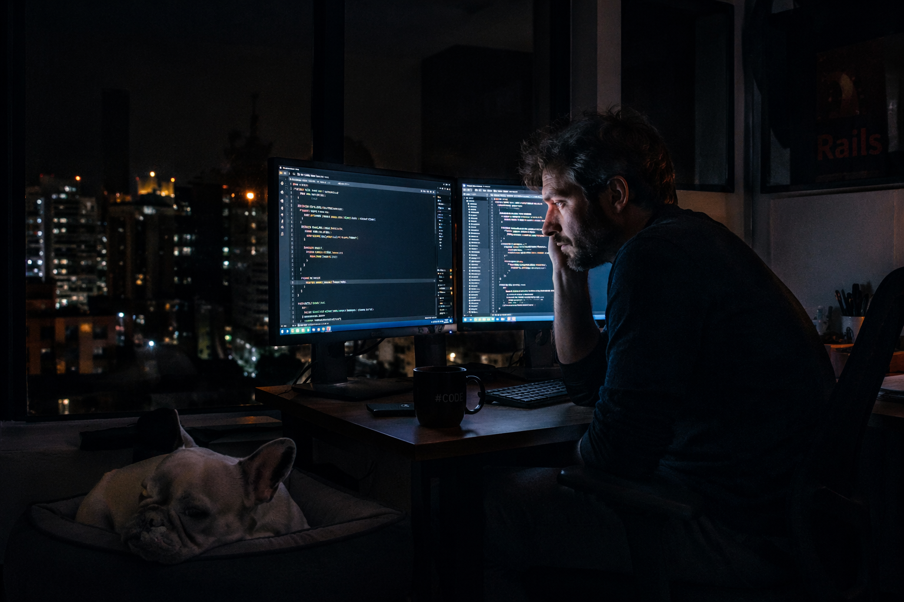

# 🕵️‍♂️ THE RAILS NOIR: DEADLOCK NO POSTGRES

**"03:00 AM em BH. O log não mente. O sistema caiu."**

---

### [🎙️ ESCUTAR NARRAÇÃO DO PROJETO](monologo-noir.mp3)

## 📒 O PROJETO
Uma experiência **transmídia** curta que une o suspense do **Cinema Noir** com o caos técnico do desenvolvimento **Backend**. O objetivo foi testar o limite do realismo (Natty) combinando roteiro técnico e estética visual densa.

---

## 🤖 STACK TECNOLÓGICA
| Função | Ferramenta | Objetivo |
| :--- | :--- | :--- |
| **Cérebro** | `Claude 3.5 Sonnet` | Roteiro visceral e técnico. |
| **Olhos** | `DALL-E 3` | Direção de arte cinematográfica (35mm). |
| **Voz** | `ElevenLabs` | Narração com profundidade emocional. |
| **Filtro** | `Gemini Ultra` | Revisão lógica e técnica do sistema. |

---

## 🧐 PROCESSO DE CRIAÇÃO
1. **Roteiro Noir:** Usei o **Claude** para criar um monólogo que falasse de **Deadlocks** e **Sidekiq** sem parecer um manual de instruções.
2. **Fotografia:** No **ChatGPT**, refinei o prompt para evitar o visual "brilhante" de IA, forçando sombras profundas e grão de filme.
3. **Áudio de Elite:** No **ElevenLabs**, ajustamos a cadência para dar pausas dramáticas onde o personagem "toma café".
4. **Refino Natty:** O **Gemini** garantiu que a documentação estivesse limpa e o código citado fizesse sentido para um dev sênior.

---

## 💭 REFLEXÃO
A IA gera a imagem, mas o **humano dá o contexto**. O desafio foi evitar o "vale da estranheza". O foco no **hiperfoco do TDAH** permitiu ajustar os detalhes mínimos — da luz do monitor ao tom da voz — para que o resultado final parecesse uma cena real de um filme perdido.

---

  Desenvolvido por <b>Pedro Victor Oliveira Guimarães</b> no Lab da DIO.

